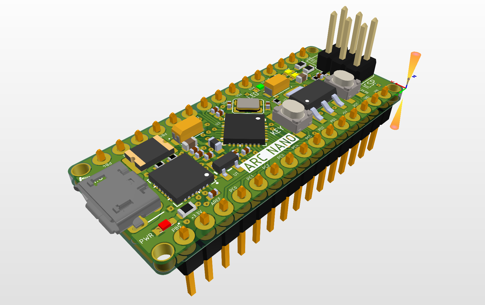

# ArcNano / STUDLAB

> ATmega328P
* 16 MHz, 2K RAM, 32K ROM
> ATmega328PB
* In developing.

* **Board with `STUDLAB` Logo and `version number` is our board, quality guarantee**
* If you have any questions, please contact us by email (vladubase@gmail.com).

## Features

* ATmega328P AVR
+ `20 MHz` maximum frequency, 1 MIPS/MHz (Dhrystone 2.1) performance at 0 wait state memory access
+ `32 Kbytes` of Flash memory, `2 Kbytes` of SRAM, `1 Kbytes` of EEPROM

* `16 MHz` system crystal
* Yellow LED `RX` Active high
* Yellow LED `TX` Active high
* Red power LED `PWR`
* Green user LED `LED`
* 2x15 side pins && 2x3 ICSP pins
* Size: `43.18 mm x 17.78 mm`

|Dir Name|Explain|
| :--:|:--:|
|Docs|Documentation|
|HDK|Hardware Development Kit|
|SDK|Software Development Kit|
